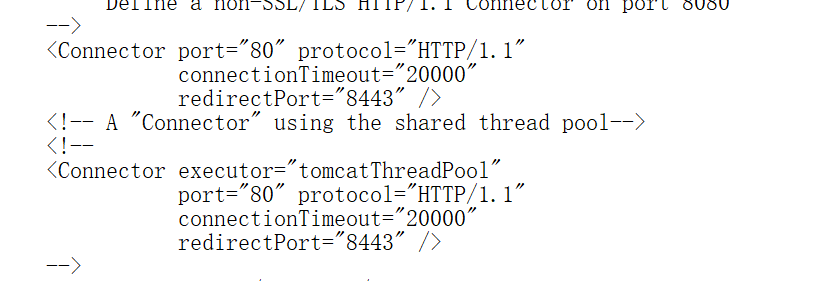
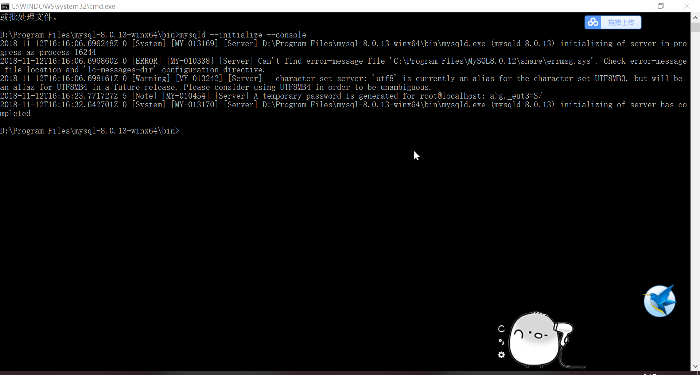
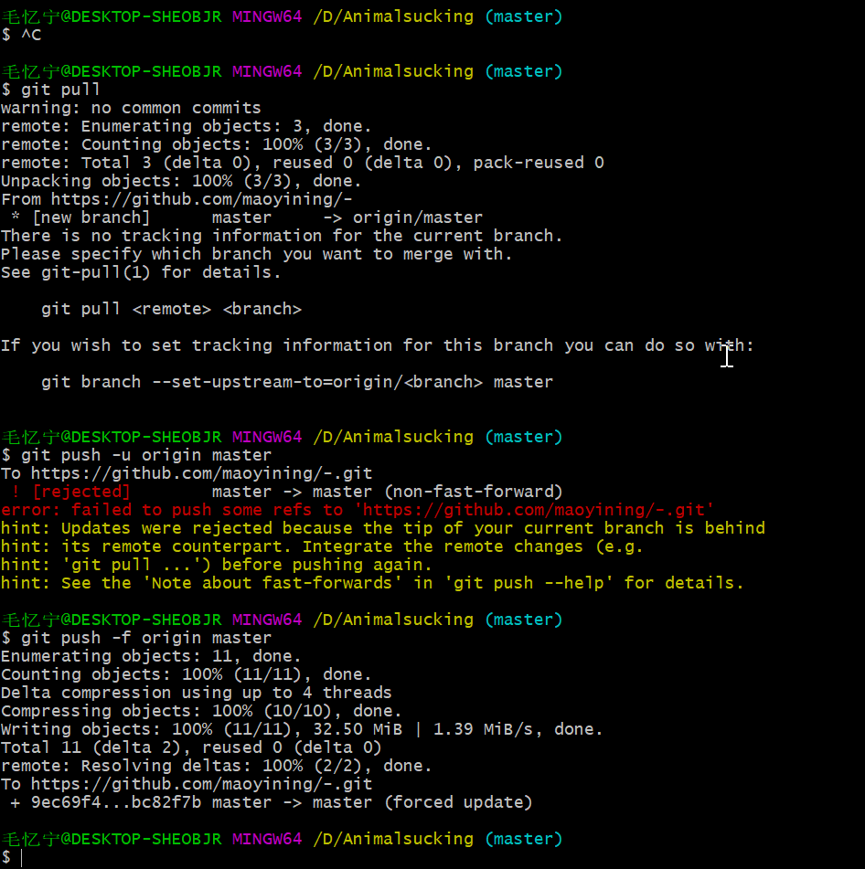
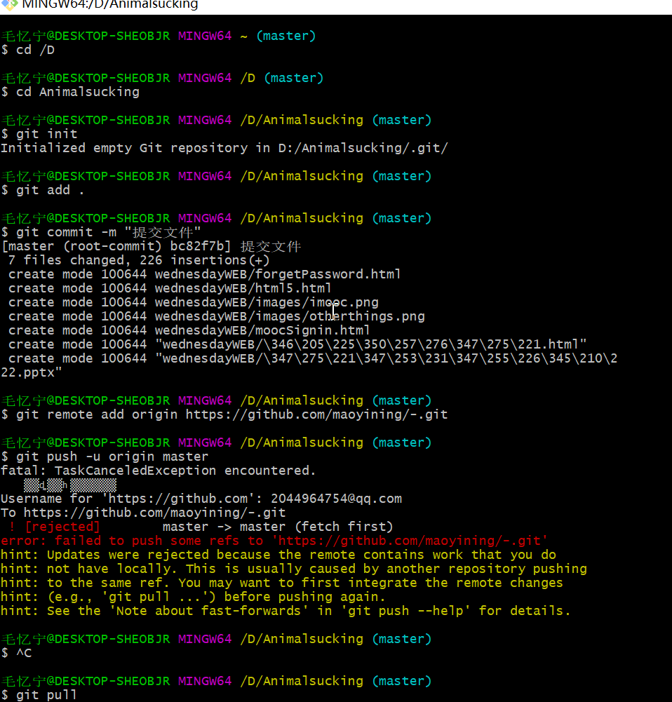

[TOC]
# 2018年学习笔记
## 一、数据结构
### 1.绪论
#### 逻辑结构和物理结构：
-  **逻辑结构**(数据对象中数据元素的相互关系)：包括集合结构、线性结构、树形结构和图形结构。
-  **物理结构**(数据的逻辑结构在计算机中的存储形式)：包括顺序存储结构和链式存储结构。
### 2.算法
-  **特性**：有穷性、确定性、可行性、输入、输出(必不可少)
-  **算法的设计要求**：正确性、可读性、健壮性、效率与低存储量需求
-  **常见的时间复杂度**：O(1)<O(logn)<O(n)<O(nlogn)<O(n²)<O(n³)<O(2^n)<O(n!)<O(n^n)
### 3.线性表

>   **特性**:里面的元素仅有一个直接前驱和仅有一个前驱后继

-  **单链表的插入和删除：**
`易错`在p节点之后插入s节点：s->next=p->next;p->next=s; `切记不能反过来`
-  **线性表的顺序存储结构：** 可快速存取表中任一位置的元素，插入删除操作不便
-  **线性表的链式存储结构：**
### 4.栈
- **什么是栈？**栈是限定仅在表尾进行插入和删除操作的线性表   保持距离
 
## 二、JAVA WEB程序设计
**2018.9.11踩坑笔记：**
今天装TOMCAT,累死我了，从毛概课一直装到晚上8点，装完之后怎么也访问不到localhost:8080，真的是很生气了，最后，我将服务器的监听端口改为了80，方法是，在Tomcat安装目录下的conf目录找到文件“server.xml”文件，用记事本打开，修改如图：

然后我就去访问80端口，最后成功访问了！！！
不幸的是，某一天tomcat突然又不能用了，我真的好生气，我恨tomcat！！！！


**2018.11.17**
**在myeclipse上连接mysql的记录**：

各种驱动不兼容，我给跪了。(我用的是1.7的jdk)

- 继续说驱动的事儿，这tomcat7竟然还觉得mysql-connect-java8的版本太高了，于是，根据鬼才看得懂的报错信息，我只能又默默地重新去下一个mysql-connect-java5.
- mysql8相对于mysql-connect-java5的版本又太高，于是我又重新去下了一个mysql5，端口改成3305了，因为之前电脑上已经装了两个版本的mysql了。。。
- Tomcat的Path里也要添上jar的路径.
- 还有一点，WEB-INF下的lib文件夹里，一定要把驱动复制进去，否则会报警。
- tomcat7.+配mysql驱动5.+，tomcat8.+配mysql驱动6.+，
你们能不能和谐一点，不要老是嫌弃对方版本过低或过高。。。。。嗯？！
我要给跪了。


-------------------------------------------------------
**2018.11.11学习记录**：
**实现页面跳转的方法：**
- html链接
```
<a href = "urlP2.jsp">到达P2</a>
```
- jsp动作(在同一个Web应用程序内资源之间的转发请求)
```
<jsp:forward page="文件名"/>
<jsp:forward page="文件名"></jsp:forward>
```

- 利用response对象进行重定向(可以访问其它站点的资源)，代码如下：
```
<%response.sendRedirect("/Prj07/responseTest3.jsp");%>
```
- 利用表单的提交
```
<form action="responseTest2.jsp">
	<input type="submit" value="提交">	
</form>
```

 A temporary password is generated for root@localhost: #7g7kJprHeWE
### HTML基础
**单标签：**
**双标签：**
https://blog.csdn.net/u014203449/article/details/80812633
## 三、WEB前端开发技术


rem和em的区别
frontawesome.com.cn
## 四、数据库系统原理
### 1.建立数据模型
现实世界抽象化→信息世界(难点)→数据世界

## 五、概率论与数理统计

