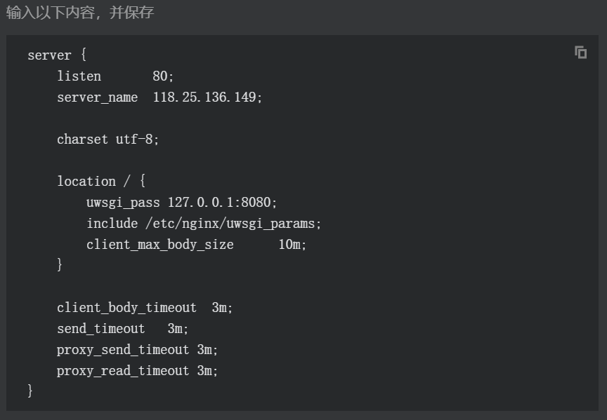

# 服务器小白的play（一）
**2018.7.26**

> 前几天买了一个服务器玩玩，想要让它能被人访问。
> 之前几天在服务器上装了乱七八糟的东西，我自己都记不清自己做了什么，很懵逼，然后给服务器重装了系统，索性再重0开始。
> 为了不重蹈从前的覆辙，现在我每做一件事，就都记录下来：
在进行这些事之前：要在自己的电脑上装两个软件winscp和putty,这两个安装过程网上有一堆。(winscp是用来传输文件的，将电脑上的文件传送到服务器里，putty是用来输入命令行控制服务器的，可以输入Linux指令在服务器上安装软件，运行代码......之类的，这是从盛大佬那里得知)
1.装了MySQL我参考的是：[MySQL的安装指南](https://blog.csdn.net/lxfHaHaHa/article/details/59112975)
目前只是装了一下，还没有对MySQL进行配置让MySQL能被别人访问。
我还是把里面的详细步骤再搬到这里来吧。

**打开putty并登陆，输入指令：**

    sudo apt-get install mysql-server


安装到一半会有一个这个东西出来，输入Y，回车，接下来会要求你输入两次登录密码(自己设定)，然后再输入指令
```
sudo apt-get install mysql-client 回车
sudo apt-get install libmysqlclient-dev 回车
```
最后检验nginx是否安装成功

    sudo netstat -tap | grep mysql 回车
    
   如果看到有mysql 的socket处于 listen 状态则表示安装成功 
   -----------------------------------------------------------------------------------------------

**2.安装并配置nginx**
这个是我在腾讯云实验室发现有教程，然后就照着弄了一下





**3.安装express**
输入指令
4.输入了npm install express之后出现下面这个画面，我也不知道这算成功了没。。。


然后再写一个代码，命名为app.js
代码内容如下：[这里是看了姜妈妈的博客，点击查看](http://jzt.mcfhq.com/blog/nodeandnpm.html)
顺便把代码复制过来:

```
var express = require('express');
var app = express();

app.get('/', function (req, res) {
  res.send('Hello World!');
});

var server = app.listen(3000, function () {
  var host = server.address().address;
  var port = server.address().port;

  console.log('Example app listening at http://%s:%s', host, port);
});
```
然后再输入指令

```
node app.js    回车
```
这时有可能会出现下面这种情况：

这时只要按照提示输入 

```
sudo apt install nodejs-legacy
```
然后再运行node app.js就行了

成功后会出现下面这个东西

最后，在浏览器里访问  
xxx.xxx.xxx.xxx(你的服务器域名):3000
就可以访问了，小菜鸡终于看到了helloworld。快乐~~
直接在命令行里输入pip install pygame，即可成功下载，可能它会自动检测电脑Python的版本而下载对应的pygame版本，
##GITbook
**2018.9.3**

> 今天看了一下gitbook，发现这是一个很好的东西。（有服务器就能做很多事，有意思）

**首先**：虽然之前装过nodejs,但是自动装的nodejs的版本是hin低的，所以今天我来重新弄一次嘻嘻嘻。安装参考如下：
[官方给出的nodejs的最新稳定版的安装方法链接](https://nodejs.org/en/download/package-manager/#debian-and-ubuntu-based-linux-distributions)
然后呢便是在服务器上安装gitbook服务器啦，服务器用的是ubuntu，[点击查看安装过程](https://blog.csdn.net/lj1404536198/article/details/78423671)
依次进行命令行操作：
```
sudo npm install -g gitbook-cli
```

```
gitbook -V
```

```
sudo apt-get install calibre 
```

https://blog.csdn.net/lu_embedded/article/details/81100704
http://blog.csdn.net/zijie_xiao/article/details/51114917
https://blog.csdn.net/stu059074244/article/details/77767835
